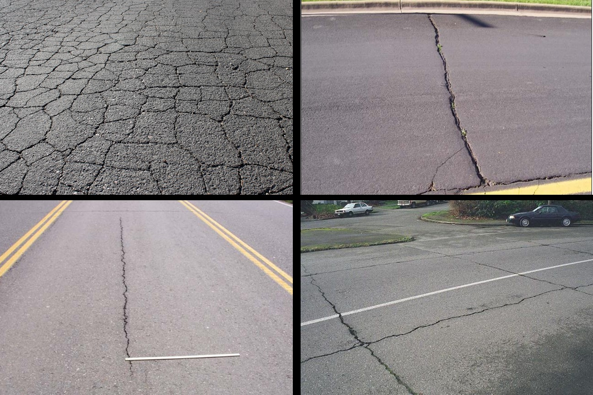

# Condition Assessment of Roads in United States

United States has more than 4 million miles of paved public roads. Cracking is a major form of deterioration in asphalt roads which shortens the pavement life and results in premature failure of the pavement structure. The goal of this project is to use different exploratory data analysis methods to carefully analyze occurrence of cracks in US roads in the past 15 years.Several features such as road type, age of the road, performance grade high temperature (PGHT) and performance grade low temperature (PGHT) of asphalt binder, and dosage of fiber reinforcement used in road construction along with the tensile strength, fracture energy, embrittlement temperature of materials used in the road will be considered in the analysis. 

### Dataset
The dataset which will be used in this project is composed of around 3000 datapoints containing 13 different road design features along with the cracking condition of the roads over a period of 15 years. 

